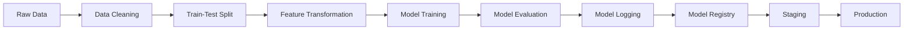

# Swiggy Delivery Time Prediction

This project implements a machine learning pipeline to predict delivery times for Swiggy orders using a stacked ensemble approach. The system is deployed as a production-ready API service with automated CI/CD pipelines.

## Project Overview

The project follows a comprehensive pipeline from data processing to model deployment, incorporating best practices in MLOps and DevOps.

### Data Pipeline

1. **Raw Data Processing**
   - Initial data collection and storage
   - Data cleaning and preprocessing
   - Exploratory Data Analysis (EDA)
   - Feature engineering and transformation

2. **Model Development**
   - Stacked Ensemble Approach:
     - Base Models: LightGBM and Random Forest
     - Meta Model: Linear Regression
   - Hyperparameter Tuning using Optuna
   - Cross-validation for robust evaluation

### MLOps Pipeline (DVC)



1. **Data Version Control (DVC)**
   - Raw data versioning
   - Data cleaning and transformation tracking
   - Model artifact versioning

2. **Model Lifecycle**
   - Model training and evaluation
   - MLflow integration with DAGsHub
   - Model registry management
   - Staging to production promotion

### API Development

- **FastAPI Implementation**
  - High-performance API server
  - Pydantic data validation
  - Async support
  - Automatic API documentation

### Deployment Architecture

1. **Containerization**
   - Docker image creation
   - Amazon ECR repository
   - Container optimization

2. **Infrastructure (AWS)**
   - EC2 instance deployment
   - Auto Scaling Group configuration
     - Minimum: 1 instance
     - Maximum: 3 instances
   - CodeDeploy integration
   - Rolling update strategy

### CI/CD Pipeline

1. **Continuous Integration**
   - Model testing
   - Performance validation
   - Error threshold monitoring (< 5 minutes)
   - Automated testing

2. **Continuous Deployment**
   - ECR image pull
   - Deployment testing
   - Sample data validation
   - Automated rollback capability

## Getting Started

### Prerequisites

- Python 3.8+
- Docker
- AWS Account
- DVC
- MLflow

### Installation

1. Clone the repository:
```bash
git clone [repository-url]
```

2. Install dependencies:
```bash
pip install -r requirements.txt
```

3. Set up DVC:
```bash
dvc init
dvc remote add -d [remote-name] [remote-url]
```

### Usage

1. Run the data pipeline:
```bash
dvc repro
```

2. Start the API server:
```bash
uvicorn app.main:app --host 0.0.0.0 --port 8000
```

## Model Performance

The model is evaluated based on the following criteria:
- Mean Absolute Error (MAE)
- Root Mean Squared Error (RMSE)
- Error threshold: < 5 minutes

## Deployment

The application is automatically deployed through AWS CodeDeploy with the following features:
- Rolling update strategy
- Auto-scaling capabilities
- Health monitoring
- Automated rollback on failure

## Contributing

1. Fork the repository
2. Create a feature branch
3. Commit your changes
4. Push to the branch
5. Create a Pull Request
